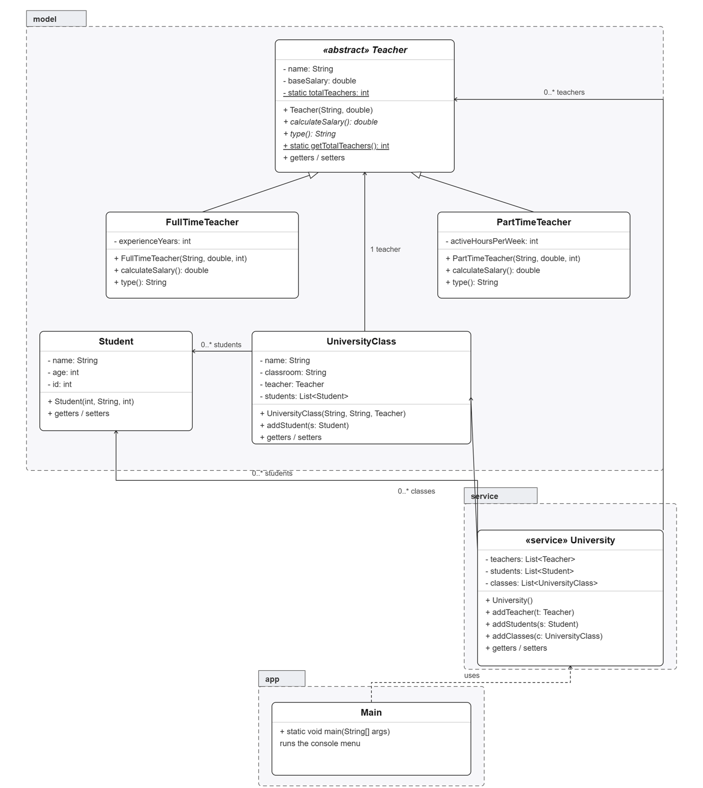

# University Management System — Java Basics Final Project

Console-based Java application to manage a university's teachers, students and classes.

## Features

- Print all teachers with their calculated salary (polymorphic, based on teacher type).
- List all classes and view the detail of one, including its teacher and enrolled students.
- Create a new student and enroll them in an existing class.
- Create a new class, assigning an existing teacher and one or more existing students.
- Search all classes a given student belongs to, by student ID.

## Requirements covered

- **Access modifiers**: private fields, public constructors/methods.
- **Encapsulation**: all model fields are private, accessed only through getters/setters.
- **Inheritance**: `FullTimeTeacher` and `PartTimeTeacher` extend the abstract class `Teacher`.
- **Polymorphism**: `calculateSalary()` and `type()` behave differently per subclass, called through `Teacher` references.
- **Constructors**: every model class has an explicit constructor.
- **Static attributes/methods**: `Teacher.totalTeachers` (static attribute) and `Teacher.getTotalTeachers()` (static method).
- **Main class**: `com.university.app.Main`.
- **Packages and layers**:
  - `com.university.model` — data classes only (`Teacher`, `FullTimeTeacher`, `PartTimeTeacher`, `Student`, `UniversityClass`)
  - `com.university.service` — business logic (`University`)
  - `com.university.app` — entry point and console menu (`Main`)
- **Reading and printing** happen entirely in `Main` (app layer), never inside the model classes.

## Salary rules

- Full time teacher: `baseSalary * (1.10 * experienceYears)`
- Part time teacher: `baseSalary * activeHoursPerWeek`

## How to run

Open the project in IntelliJ IDEA and run `com.university.app.Main`, or from the command line:

```bash
javac -d out $(find src -name "*.java")
java -cp out com.university.app.Main
```

## Menu options

1. Print all teachers with their data
2. Print all classes and view the detail of one
3. Create a new student and add them to an existing class
4. Create a new class and assign an existing teacher and students
5. List all classes a given student (by ID) belongs to
6. Exit

## Design diagram

